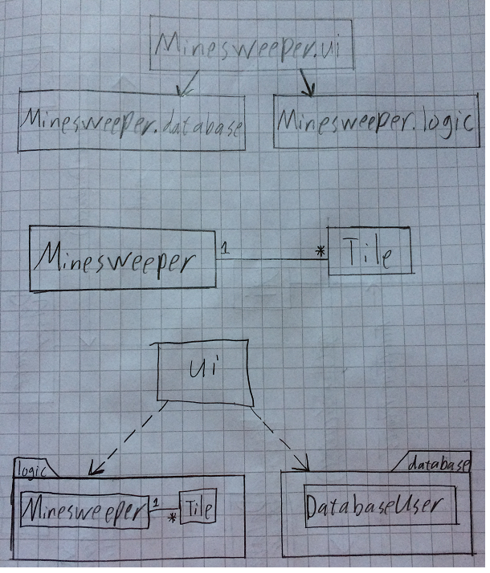
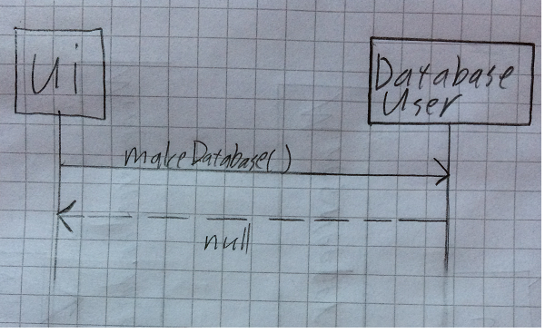
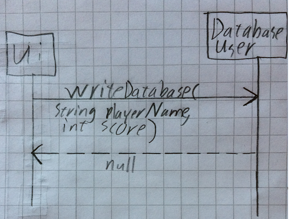

# Rakenne:

tällä hetkellä sovelluksen pakkausrakenteessa on kolme pakkausta Minesweeper.ui ja Minesweeper.logic sekä Minesweeper.database.

# Käyttöliittymä:

Sovellukseni käyttöliittymässä on neljä eri näkymää:
- Miinaharavan peli näkymä
- Päävalikon näkymä
- Parhaitten pisteiden näkymä
- Pelin tulos näkymä

Näkymät on toteutettu Scene olioina ja ne liitetään sovelluksen Stage olioon.
Käyttöliittymä on toteutettu luokassa Minesweeper.ui.MinesweeperUI.

# Sovelluslogiikka:

Sovelluslogiikkaan kuuluu luokat Minesweeper ja Tile.
Minesweeper luokka hoitaa pelin alustan teknisen luomisen, solujen luomisen ja tarjoaa soluille
myös tärkeän metodin niiden ympäristön selvittämiseksi.
Tile luokka taas kuvaa pelin soluja ja se myös määrittää mitä tapahtuu sen ympäristön soluille tietyssä tilanteessa.

#### Luokan Minesweeper tarjoamia toiminnallisuuksia:
- setupGame()
    Alustaa pelin luoden ruudukon ja sen ominaisuudet
- getNeighbours(Tile tile)
    Haravoi tietyn ruudun ympäristön ja palauttaa listan naapuriruuduista
    
#### Luokka/pakkauskaavio sovelluksen eri osista:

# Pysyväistalletus:

Luokka DatabaseUser hoitaa tietokantaan tallentamisen ja lukemisen.
Sovellus käyttää sqlite tietokantaa, johon tallennetaan nimiä ja pisteitä.

### Päätoiminnallisuudet:

#### Tietokannan teko:
Sovelluksen käynnistyessä kutsutaan DatabaserUserin metodia makeDatabase(), joka
luo sqlite tietokannan Scores, jos sitä ei ole vielä luotu. Samalle se myös luo Scores
taulun, johon pisteet ja pelaajan nimet tallennetaan.

#### Tietokantaan tallentaminen:
Pelin päättyessä pelaaja voi tallentaa pisteensä tietokantaan. Save-nappia
painettaessa kutsutaan DatabaserUser luokan metodia writeDatabase, jossa 
parametreina annetaan pelaajan nimi ja pisteet. Metodi ei palauta mitään.

#### Huippupisteiden luku tietokannasta
Highscore-nappia painettaessa kutsutaan DatabaserUser luokan metodia getHighScores,
joka palauttaa ArrayListinä viisi parasta tulosta. Nämä sitten näytetään pelaajalle.
